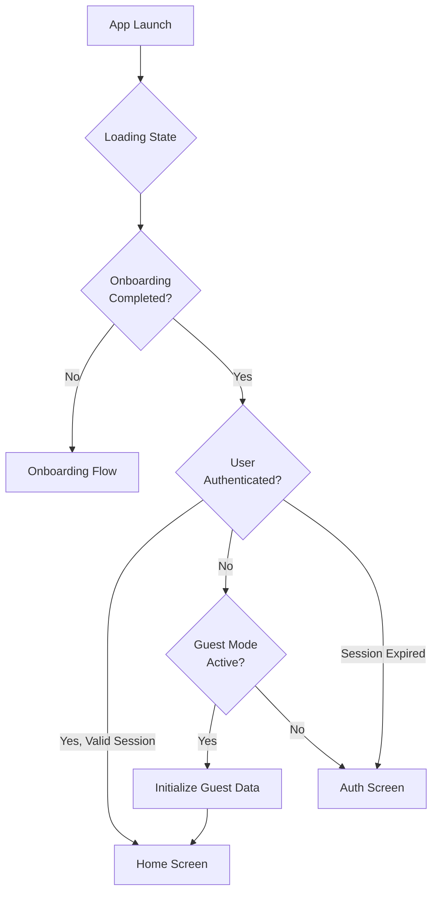
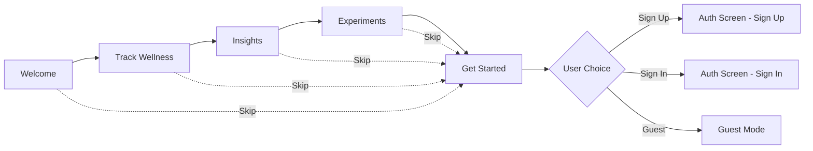
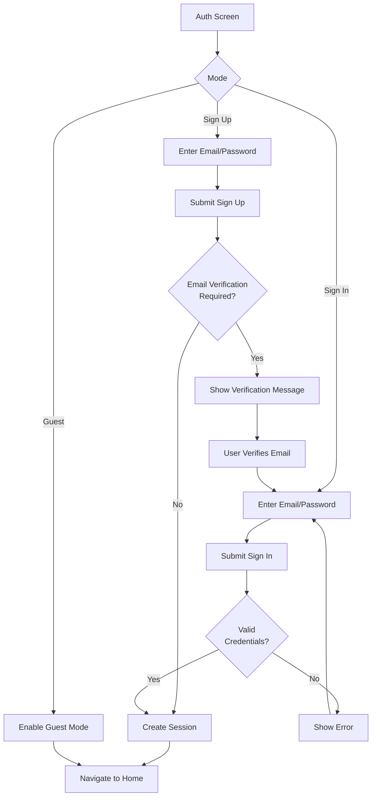
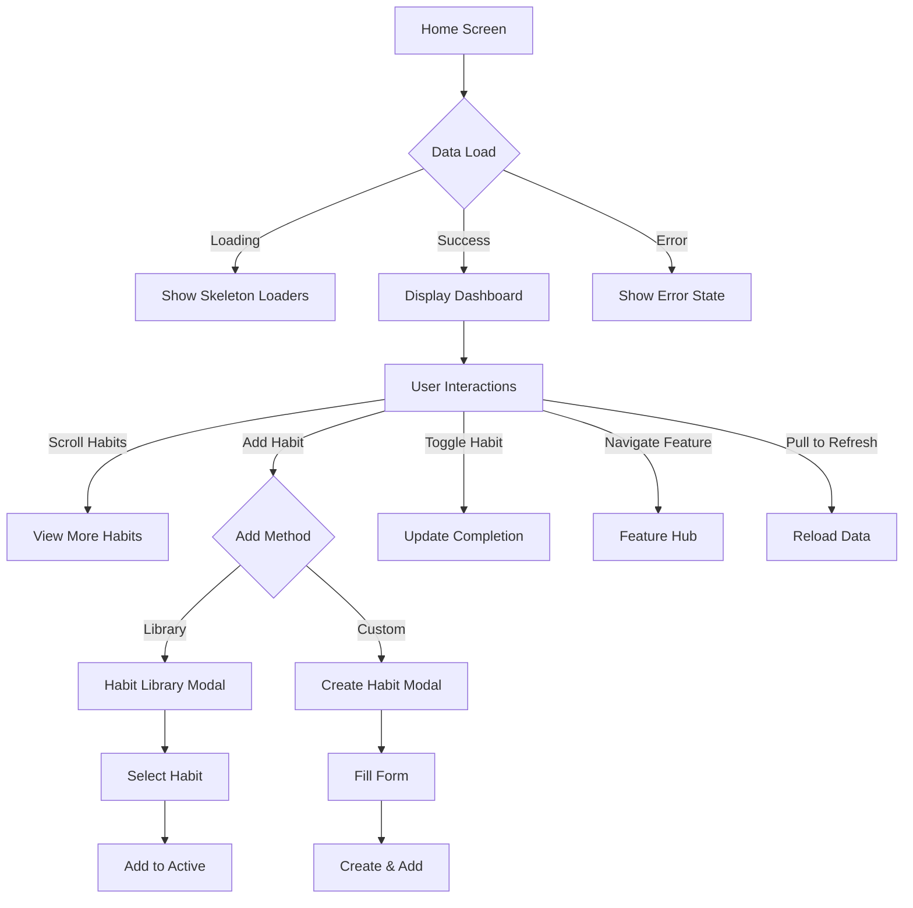
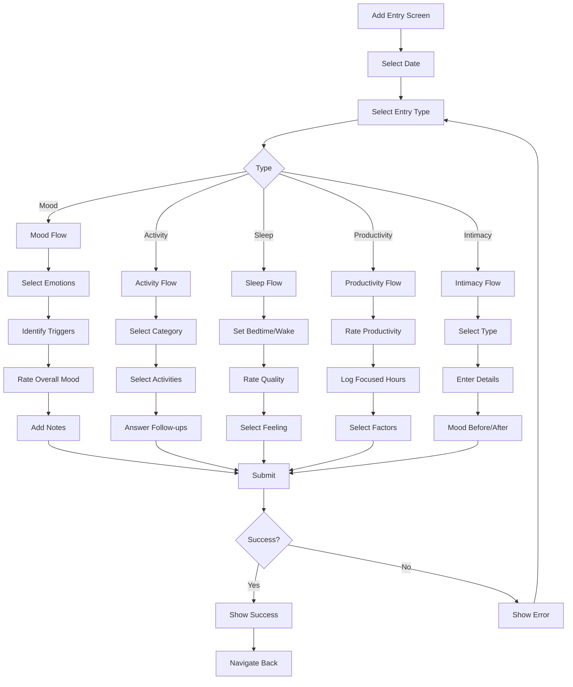
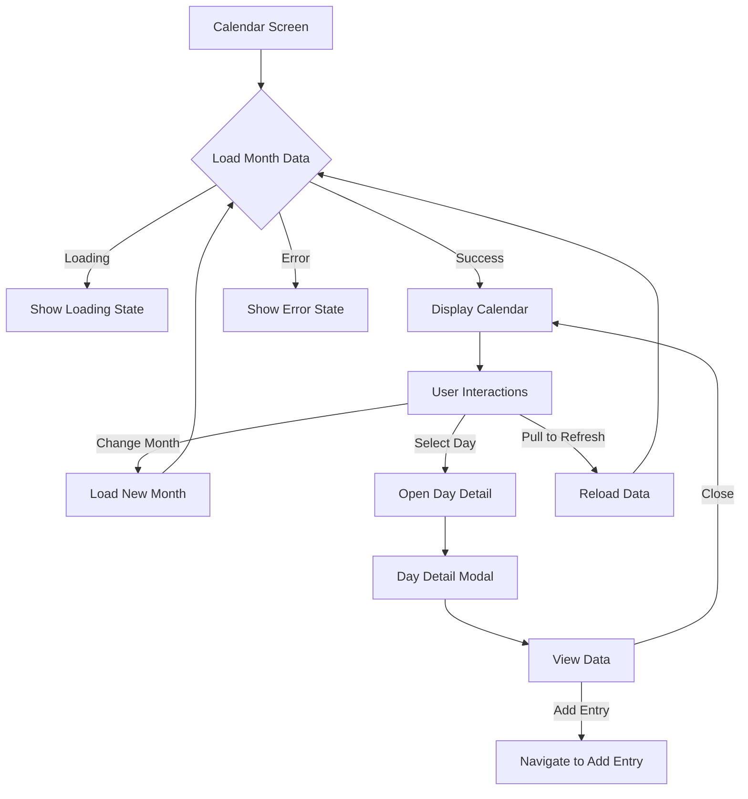
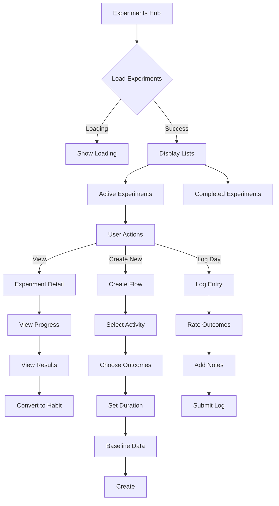
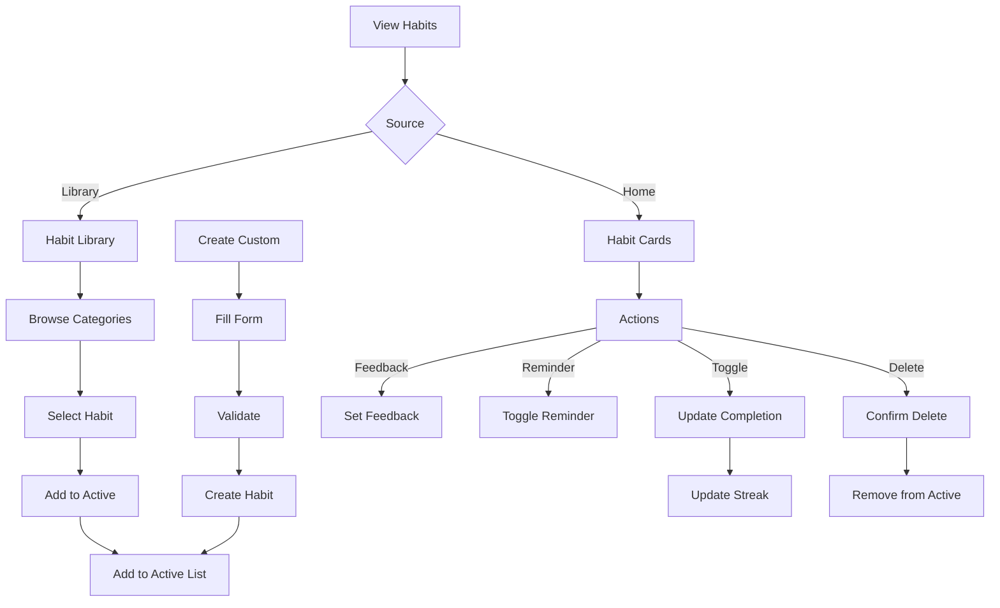
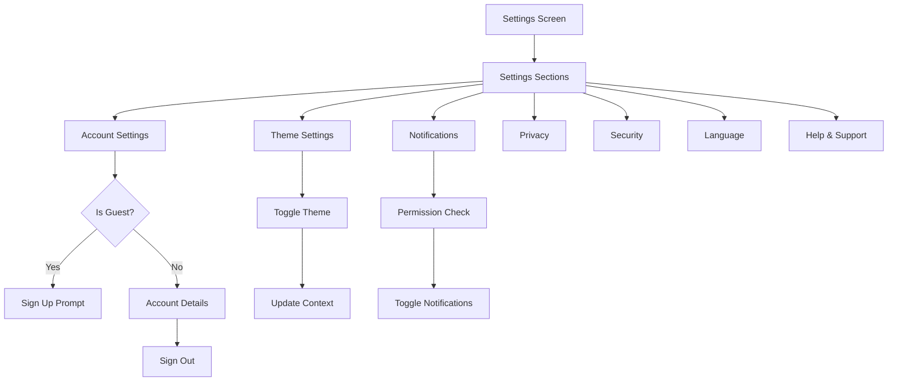

# Betternapped User Flows

**Last Updated**: October 30, 2025  
**Purpose**: Comprehensive documentation of all user flows, screen interactions, and edge cases for the Betternapped wellness tracking application.

---

## Table of Contents

1. [App Initialization Flow](#1-app-initialization-flow)
2. [Onboarding Flow](#2-onboarding-flow)
3. [Authentication Flow](#3-authentication-flow)
4. [Home Screen Flow](#4-home-screen-flow)
5. [Add Entry Flow](#5-add-entry-flow)
6. [Calendar Flow](#6-calendar-flow)
7. [Experiments Hub Flow](#7-experiments-hub-flow)
8. [Habit Management Flow](#8-habit-management-flow)
9. [Settings Flow](#9-settings-flow)
10. [Specialty Hubs](#10-specialty-hubs)
11. [Edge Cases & Error Handling](#11-edge-cases--error-handling)

---

## 1. App Initialization Flow

### Overview
Determines user's authentication state and directs them to the appropriate starting point.

### Flow Diagram



### Screen: `app/index.tsx`

**Entry Point**: App launch

**Loading Sequence**:
1. Display loading indicator with app logo/branding
2. Check AsyncStorage for `onboarding_completed` flag
3. Check Supabase session via `supabase.auth.getSession()`
4. Check AsyncStorage for `guest_mode` flag
5. Initialize guest data if in guest mode

**Decision Logic**:
```typescript
if (loading || onboardingCompleted === null) {
  // Show loading screen
}

if (!onboardingCompleted) {
  // Redirect to /onboarding/welcome
}

if (user || isGuest) {
  // Redirect to /(tabs)/home
}

// Otherwise redirect to /auth/auth
```

**Exit Points**:
- `/onboarding/welcome` - First time users
- `/(tabs)/home` - Authenticated or guest users
- `/auth/auth` - Users who completed onboarding but not authenticated

**Error States**:
- AsyncStorage read failure: Assume onboarding not completed
- Supabase connection error: Log warning, allow guest mode
- Session validation error: Clear session, redirect to auth

---

## 2. Onboarding Flow

### Overview
5-screen introduction to app features and benefits, ending with authentication choice.

### Flow Diagram



### Screen 1: Welcome (`app/onboarding/welcome.tsx`)

**Purpose**: Introduce the app and set expectations

**UI Elements**:
- Heart icon with accent color background
- Title: "Welcome to Betternapped"
- Subtitle: "Your personal wellness companion for tracking, experimenting, and optimizing your life"
- Progress indicator (1 of 5)
- "Get Started" button
- "Skip" button (top right)

**User Actions**:
- Tap "Get Started" → Navigate to Track Wellness
- Tap "Skip" → Navigate to Get Started screen

**Data Operations**: None

---

### Screen 2: Track Wellness (`app/onboarding/track-wellness.tsx`)

**Purpose**: Explain core tracking features

**UI Elements**:
- Feature icon/illustration
- Title describing tracking capabilities
- Description of mood, sleep, activities tracking
- Progress indicator (2 of 5)
- "Next" button
- "Skip" button

**User Actions**:
- Tap "Next" → Navigate to Insights
- Tap "Skip" → Navigate to Get Started
- Tap "Back" → Navigate to Welcome

**Data Operations**: None

---

### Screen 3: Insights (`app/onboarding/insights.tsx`)

**Purpose**: Showcase analytics and AI recommendations

**UI Elements**:
- Analytics icon/illustration
- Title about personalized insights
- Description of correlation analysis
- Progress indicator (3 of 5)
- "Next" button
- "Skip" button

**User Actions**:
- Tap "Next" → Navigate to Experiments
- Tap "Skip" → Navigate to Get Started
- Tap "Back" → Navigate to Track Wellness

**Data Operations**: None

---

### Screen 4: Experiments (`app/onboarding/experiments.tsx`)

**Purpose**: Introduce experiment feature

**UI Elements**:
- Experiment icon/illustration
- Title about running experiments
- Description of testing habits
- Progress indicator (4 of 5)
- "Next" button
- "Skip" button

**User Actions**:
- Tap "Next" → Navigate to Get Started
- Tap "Skip" → Navigate to Get Started
- Tap "Back" → Navigate to Insights

**Data Operations**: None

---

### Screen 5: Get Started (`app/onboarding/get-started.tsx`)

**Purpose**: Final onboarding screen with authentication options

**UI Elements**:
- Welcome message
- Three prominent buttons:
  - "Sign Up" (primary)
  - "Sign In" (secondary)
  - "Continue as Guest" (tertiary)
- Progress indicator (5 of 5)

**User Actions**:
- Tap "Sign Up" → Set `onboarding_completed`, navigate to Auth (sign up mode)
- Tap "Sign In" → Set `onboarding_completed`, navigate to Auth (sign in mode)
- Tap "Continue as Guest" → Set `onboarding_completed`, set `guest_mode`, initialize guest data, navigate to Home

**Data Operations**:
```typescript
// For all options
await AsyncStorage.setItem('onboarding_completed', 'true');

// For guest mode
await AsyncStorage.setItem('guest_mode', 'true');
await initializeGuestData();
```

**Exit Points**:
- `/auth/auth` - Sign up or sign in
- `/(tabs)/home` - Guest mode

---

## 3. Authentication Flow

### Overview
Handles user sign up, sign in, and guest mode with Supabase Auth.

### Flow Diagram



### Screen: Auth (`app/auth/auth.tsx`)

**Entry Point**: 
- From onboarding "Sign Up" or "Sign In"
- From Settings when not authenticated
- When session expires

**UI Elements**:
- Tab selector: "Sign In" / "Sign Up"
- Email input field
- Password input field
- "Sign In" or "Sign Up" button (based on mode)
- "Continue as Guest" button (alternative option)
- Loading spinner during submission

**Sign Up Flow**:

1. User enters email and password
2. Tap "Sign Up" button
3. Validate inputs:
   - Email format valid
   - Password meets requirements (min 6 characters)
4. Call `AuthContext.signUp(email, password)`
5. Handle response:
   - Success with session → Navigate to Home
   - Success without session → Show email verification message
   - Error → Display error message

**Sign Up API Call**:
```typescript
const result = await signUp(email, password);

if (result.success) {
  if (result.needsVerification) {
    Alert.alert(
      'Verify Email',
      'Please check your email to verify your account.'
    );
  } else {
    // Auto-navigate to home (handled by AuthContext)
  }
} else {
  Alert.alert('Sign Up Failed', result.error);
}
```

**Sign In Flow**:

1. User enters email and password
2. Tap "Sign In" button
3. Validate inputs:
   - Email not empty
   - Password not empty
4. Call `AuthContext.signIn(email, password)`
5. Handle response:
   - Success → Navigate to Home
   - Error → Display error message

**Sign In API Call**:
```typescript
const result = await signIn(email, password);

if (result.success) {
  // Auto-navigate to home (handled by AuthContext)
} else {
  Alert.alert('Sign In Failed', result.error);
}
```

**Guest Mode Flow**:

1. User taps "Continue as Guest"
2. Call `AuthContext.continueAsGuest()`
3. Set guest mode flag in AsyncStorage
4. Initialize sample guest data
5. Navigate to Home

**Guest Mode API Call**:
```typescript
await continueAsGuest();
// Automatically sets guest_mode flag and navigates
```

**Validation Rules**:
- Email: Must be valid email format
- Password (Sign Up): Minimum 6 characters
- Password (Sign In): Any length (let backend validate)

**Error Messages**:
- "Invalid email address"
- "Password must be at least 6 characters"
- "Email already registered"
- "Invalid credentials"
- "Network error. Please try again."

**Loading States**:
- Disable form during submission
- Show loading spinner on submit button
- Prevent multiple submissions

**Exit Points**:
- `/(tabs)/home` - Successful authentication or guest mode

---

## 4. Home Screen Flow

### Overview
Central hub showing wellness snapshot, habits, insights, and navigation to features.

### Flow Diagram



### Screen: Home (`app/(tabs)/home.tsx`)

**Entry Point**: 
- After authentication
- From tab navigation
- After completing onboarding

**Data Loading**:

On mount, fetch:
1. User's active habits
2. Last 7 days mood logs
3. Last 7 days sleep logs
4. AI recommendations

```typescript
const loadData = async () => {
  const effectiveUserId = user?.id || 'guest_user';
  
  const [habitsResult, moodResult, sleepResult, recommendationsResult] = 
    await Promise.all([
      HabitsService.getAll(effectiveUserId),
      MoodsService.getByDateRange(effectiveUserId, startDate, endDate),
      SleepService.getByDateRange(effectiveUserId, startDate, endDate),
      AnalyticsService.generateAIRecommendations(effectiveUserId)
    ]);
    
  // Update state with results
};
```

**Real-time Subscriptions**:
```typescript
useRealtimeHabits(user?.id || '', loadData);
useRealtimeMoods(user?.id || '', loadData);
useRealtimeSleep(user?.id || '', loadData);
```

**UI Sections**:

1. **Welcome Card**
   - Greeting based on time of day
   - User name (if available)
   - Motivational quote

2. **Guest Mode Banner** (if `isGuest === true`)
   - Message about demo data
   - "Sign Up" button to create account

3. **Today's Snapshot Card**
   - Mood score and emoji
   - Sleep hours
   - Mental clarity indicator
   - Current streak

4. **Weekly Overview Card**
   - 7-day bar chart showing sleep hours
   - Mood emojis for each day
   - Legend

5. **Active Habits Section**
   - Horizontal scrollable cards
   - Each card shows:
     - Habit name and emoji
     - Description
     - Streak count
     - Completion checkbox
     - Progress bar
   - Empty state if no habits
   - "+ More" pill if 3+ habits

6. **Habit Action Cards**
   - "Browse Habit Library" card
   - "Create Custom Habit" card

7. **Impact Analysis Card**
   - Summary of activity impacts
   - Progress bars for metrics
   - Insights text

8. **AI Recommendations Card**
   - Up to 3 recommendations
   - "See More" link

9. **Experiments Card**
   - "Run Experiments" CTA
   - "Start Experiment" button

**User Interactions**:

### Toggle Habit Completion

**Trigger**: Tap checkbox on habit card

**Flow**:
1. Get habit ID
2. Get today's date (ISO format)
3. Call `HabitsService.logHabit()`
4. Update local state optimistically
5. Handle errors

```typescript
const handleToggleComplete = async (id: string) => {
  const habit = activeHabits.find(h => h.id === id);
  const today = new Date().toISOString().split('T')[0];
  
  const { error } = await HabitsService.logHabit(
    id,
    {
      date: today,
      completed: !habit.completedToday,
      feedback: 'good'
    },
    user.id
  );
  
  if (error) {
    Alert.alert('Error', 'Failed to update habit');
    return;
  }
  
  // Update UI
  setActiveHabits(prev =>
    prev.map(h =>
      h.id === id ? { ...h, completedToday: !h.completedToday } : h
    )
  );
};
```

### Delete Habit

**Trigger**: Delete button on habit card

**Flow**:
1. Show confirmation alert
2. If confirmed, call `HabitsService.delete()`
3. Remove from local state
4. Show success feedback

### Open Habit Library

**Trigger**: Tap "Browse Habit Library" card

**Flow**:
1. Set `habitLibraryModalVisible = true`
2. Modal displays with:
   - Header with close button
   - Empty state message (library to be implemented)
   - Close on X tap

**Modal: Habit Library** (`Modal` in home.tsx)

**UI Elements**:
- Header with "Habit Library" title
- X close button
- Content area (currently empty state)

**Exit**: Tap X or swipe down

### Create Custom Habit

**Trigger**: Tap "Create Custom Habit" card

**Flow**:
1. Set `createHabitModalVisible = true`
2. Modal displays form
3. User fills form
4. Submit creates habit

**Modal: Create Custom Habit** (`Modal` in home.tsx)

**Form Fields**:
- Habit Name (required, min 3 chars)
- Description (optional)
- Category (required, select from: Health, MentalClarity, Sleep, Mood, Intimacy, Anxiety)
- Streak Goal (number, default 30)
- Enable Reminder (toggle)
- Reminder Time (if reminder enabled)

**Validation**:
```typescript
if (!customHabitForm.name.trim()) {
  Alert.alert('Validation Error', 'Please enter a habit name');
  return;
}

if (customHabitForm.name.trim().length < 3) {
  Alert.alert('Validation Error', 'Habit name must be at least 3 characters long');
  return;
}

// Check for duplicates
const existingHabit = activeHabits.find(
  h => h.name.toLowerCase() === customHabitForm.name.trim().toLowerCase()
);
if (existingHabit) {
  Alert.alert('Already Exists', `${customHabitForm.name} is already in your active habits!`);
  return;
}
```

**Submit Flow**:
```typescript
const { data, error } = await HabitsService.create({
  name: customHabitForm.name.trim(),
  description: customHabitForm.description.trim() || 'Custom habit',
  category: customHabitForm.category,
  total_days: customHabitForm.streakGoal,
  streak: 0,
  reminder_enabled: customHabitForm.reminderEnabled,
  reminder_time: customHabitForm.reminderEnabled ? customHabitForm.reminderTime : undefined
}, user.id);

if (error) {
  Alert.alert('Error', 'Failed to create habit');
  return;
}

// Add to local state
setActiveHabits(prev => [...prev, data]);
setCreateHabitModalVisible(false);
Alert.alert('Success', `${customHabitForm.name} has been created!`);
```

**Exit**: Tap X or after successful creation

### Navigate to Feature Hubs

**Available Navigation**:
- "Improve My Sleep" card → `/sleep-wellness-hub`
- "Run Experiments" card → `/experiments-hub`
- Mental Clarity test → `/mental-clarity-test`
- Intimacy tracking → `/intimacy-hub`

### Pull to Refresh

**Trigger**: Pull down on ScrollView

**Flow**:
1. Set `refreshing = true`
2. Call `loadData()`
3. Wait for completion
4. Set `refreshing = false`

**Loading States**:

**Initial Load**:
- Show skeleton cards for each section
- Display loading spinner in center

**Empty State (No Habits)**:
- Show EmptyStateCard with:
  - Target icon
  - "No Active Habits Yet" title
  - Helpful message
  - "Add First Habit" button

**Error State**:
- Show error message
- "Retry" button
- Log error to console

**Exit Points**:
- `/sleep-wellness-hub`
- `/experiments-hub`
- `/mental-clarity-test`
- `/intimacy-hub`
- `/(tabs)/calendar` (via tab)
- `/(tabs)/activity` (via tab)
- `/(tabs)/add-entry` (via tab or floating button)
- `/(tabs)/settings` (via tab)

---

## 5. Add Entry Flow

### Overview
Multi-step form for logging different wellness data types.

### Flow Diagram



### Screen: Add Entry (`app/(tabs)/add-entry.tsx`)

**Entry Point**: 
- Tab navigation
- Floating add button
- Calendar day detail → Add entry
- From any screen prompting data entry

**Initial State**:
- Date selector at top (defaults to today)
- Five entry type cards:
  1. **Mood** - Heart icon, "Track your emotional state"
  2. **Activity** - Activity icon, "Log daily activities"
  3. **Sleep** - Moon icon, "Record sleep patterns"
  4. **Productivity** - TrendingUp icon, "Measure productivity"
  5. **Intimacy** - Sparkles icon, "Track intimate wellness"

**Date Selection**:

**UI**: Date picker button showing selected date

**Interaction**:
1. Tap date button
2. Native date picker appears
3. Select date
4. Picker dismisses
5. Button updates to show new date

**Platform Behavior**:
- iOS: Modal date picker
- Android: Calendar dialog

---

### Mood Entry Flow

**Step 1: Select Emotions**

**Screen Section**: Emotion selection grid

**UI Elements**:
- Title: "How are you feeling?"
- Grid of 13 emotion options:
  - Happy 😊, Sad 😔, Angry 😠, Bored 😐
  - Tired 😴, Relaxed 😌, Excited 🤩, Desperate 😩
  - Stressed 😫, Anxious 😰, Unsure 🤔, Content 🙂
  - Grateful 🙏
- Multi-select checkboxes
- "Next" button (enabled when 1+ selected)

**User Actions**:
- Tap emotion to toggle selection
- Multiple selections allowed
- Tap "Next" to proceed

**Data Stored**:
```typescript
selectedMoods: string[] = ['Happy', 'Energetic', ...]
```

---

**Step 2: Identify Triggers**

**Screen Section**: Trigger identification

**UI Elements**:
- For each selected emotion:
  - Emotion name and emoji
  - Question: "Do you know what triggered this?"
  - Three buttons: "Yes", "No", "Unsure"
  - Text input (if "Yes" selected)
- "Next" button

**User Actions**:
1. For each emotion, select trigger response
2. If "Yes", type trigger text
3. Tap "Next"

**Data Stored**:
```typescript
emotionTriggers: {
  Happy: { hasTrigger: 'yes', text: 'Great workout' },
  Stressed: { hasTrigger: 'no', text: '' }
}
```

---

**Step 3: Rate Overall Mood**

**Screen Section**: Overall rating

**UI Elements**:
- Title: "How would you rate your overall mood?"
- 5-point scale with emojis:
  - 1: 😞 Very Bad
  - 2: 😕 Bad
  - 3: 😐 Neutral
  - 4: 🙂 Good
  - 5: 😄 Very Good
- Large tappable buttons
- "Next" button

**User Actions**:
- Tap rating button
- Tap "Next"

**Data Stored**:
```typescript
overallMoodScore: number = 1-5
selectedMoodEmoji: string = '😄'
```

---

**Step 4: Add Notes (Optional)**

**Screen Section**: Notes input

**UI Elements**:
- Title: "Any additional notes?"
- Multiline text input
- Character count (optional)
- "Submit" button

**User Actions**:
- Type notes (optional)
- Tap "Submit"

**Data Stored**:
```typescript
moodNotes: string = "Had a great day..."
```

---

**Submit: Mood Entry**

**API Call**:
```typescript
const { data, error } = await MoodsService.upsert({
  date: selectedDate,
  moods: selectedMoods,
  triggers: emotionTriggers,
  score: overallMoodScore,
  emoji: selectedMoodEmoji,
  notes: moodNotes
}, userId);
```

**Success Flow**:
1. Show success alert: "Mood logged successfully!"
2. Reset form state
3. Navigate back or stay for another entry

**Error Flow**:
1. Show error alert: "Failed to save mood. Please try again."
2. Keep data in form
3. User can retry

---

### Activity Entry Flow

**Step 1: Select Category**

**UI Elements**:
- Title: "What did you do today?"
- Expandable category sections:
  - Exercise 🏃‍♂️
  - Social ☕
  - Work 💼
  - Hobbies 📚
  - Relaxation 🧘‍♂️
  - Outdoor 🌳
  - Food 🍽️
  - Entertainment 🎬
  - Other 📝

**User Actions**:
- Tap category to expand
- View activities in category
- Select activities (multi-select)
- Tap "Next"

---

**Step 2: Activity Details**

**For each selected activity**:

**UI Elements**:
- Activity name and emoji
- Duration input (optional)
- Follow-up question (if applicable)
  - Example: "How was your workout?" for Exercise
- Text answer field

**User Actions**:
- Enter duration
- Answer follow-up
- Tap "Next" to next activity or submit

---

**Submit: Activity Entry**

**API Call** (for each activity):
```typescript
const { data, error } = await ActivitiesService.create({
  date: selectedDate,
  category: activity.category,
  name: activity.name,
  duration: activity.duration,
  emoji: activity.emoji,
  follow_up_answer: activity.followUpAnswer
}, userId);
```

**Success**: "Activities logged successfully!"

**Error**: "Failed to save activities. Please try again."

---

### Sleep Entry Flow

**Step 1: Sleep Times**

**UI Elements**:
- Title: "When did you sleep?"
- Bedtime picker
- Wake time picker
- Calculated hours display

**User Actions**:
1. Select bedtime (time picker)
2. Select wake time (time picker)
3. View calculated sleep duration
4. Tap "Next"

**Calculation**:
```typescript
const hours = calculateHoursDifference(bedtime, wakeTime);
// Handles overnight sleep (bedtime > wakeTime)
```

---

**Step 2: Sleep Quality**

**UI Elements**:
- Title: "How was your sleep quality?"
- 5-point scale:
  - 1: Poor
  - 2: Fair
  - 3: Good
  - 4: Very Good
  - 5: Excellent
- Star or emoji rating display

**User Actions**:
- Select quality rating
- Tap "Next"

---

**Step 3: Waking Feeling**

**UI Elements**:
- Title: "How did you feel when waking up?"
- Options:
  - Refreshed
  - Energetic
  - Tired
  - Groggy
  - Rested

**User Actions**:
- Select feeling
- Tap "Submit"

---

**Submit: Sleep Entry**

**API Call**:
```typescript
const { data, error } = await SleepService.upsert({
  date: selectedDate,
  bedtime: bedtime,
  wake_time: wakeTime,
  hours: calculatedHours,
  quality: qualityRating,
  waking_feeling: wakingFeeling
}, userId);
```

**Success**: "Sleep logged successfully!"

**Error**: "Failed to save sleep data. Please try again."

**Validation**:
- Bedtime and wake time required
- Quality rating 1-5 required
- Waking feeling required

---

### Productivity Entry Flow

**Step 1: Productivity Rating**

**UI Elements**:
- Title: "How productive were you today?"
- 5-point scale with descriptions
- Visual rating selector

**User Actions**:
- Select rating
- Tap "Next"

---

**Step 2: Focused Hours**

**UI Elements**:
- Title: "How many hours of focused work?"
- Number input
- Increment/decrement buttons

**User Actions**:
- Enter hours (decimal allowed)
- Tap "Next"

---

**Step 3: Contributing Factors**

**UI Elements**:
- Title: "What factors influenced your productivity?"
- Multi-select options:
  - Good sleep
  - Exercise
  - Healthy meals
  - Minimal distractions
  - Clear goals
  - Motivation
  - Other (text input)

**User Actions**:
- Select factors
- If "Other", type custom factor
- Tap "Submit"

---

**Submit: Productivity Entry**

**API Call**:
```typescript
const { data, error } = await ProductivityService.create({
  date: selectedDate,
  rating: productivityRating,
  focused_hours: focusedHours,
  factors: selectedFactors,
  other_factor: otherFactorText
}, userId);
```

**Success**: "Productivity logged successfully!"

**Error**: "Failed to save productivity data. Please try again."

---

### Intimacy Entry Flow

**Step 1: Type Selection**

**UI Elements**:
- Title: "Track your intimate wellness"
- Privacy notice
- Type options:
  - Solo
  - Couple

**User Actions**:
- Select type
- Tap "Next"

---

**Step 2: Details Collection**

**UI Elements**:
- Orgasm: Yes/No toggle
- Location: Text input (optional)
- Toy used: Yes/No toggle
- Time to sleep: Number input (minutes)

**User Actions**:
- Fill in details
- Tap "Next"

---

**Step 3: Mood Impact**

**UI Elements**:
- "Mood before" rating (1-5 scale)
- "Mood after" rating (1-5 scale)

**User Actions**:
- Rate mood before
- Rate mood after
- Tap "Submit"

---

**Submit: Intimacy Entry**

**API Call**:
```typescript
const { data, error } = await IntimacyService.create({
  date: selectedDate,
  type: intimacyType,
  orgasm: hadOrgasm,
  location: location,
  toy_used: toyUsed,
  time_to_sleep: timeToSleep,
  mood_before: moodBefore,
  mood_after: moodAfter
}, userId);
```

**Success**: "Entry logged successfully!"

**Error**: "Failed to save entry. Please try again."

---

### Common Entry Features

**Navigation**:
- Back button at each step (except first)
- Progress indicator showing step number
- Cancel button to exit flow

**Validation**:
- Required fields highlighted if missing
- Inline validation messages
- Submit button disabled until valid

**Loading States**:
- Show spinner during API call
- Disable form inputs
- Prevent duplicate submissions

**Success Feedback**:
- Success alert with checkmark
- Brief confirmation message
- Option to add another entry or return

**Error Handling**:
- Network errors: "No internet connection"
- Validation errors: Specific field messages
- Server errors: "Something went wrong. Please try again."
- Duplicate entry: "Entry for this date already exists. Update instead?"

**Exit Points**:
- After successful submission → Previous screen or Home
- Cancel button → Confirm dialog → Previous screen
- Back navigation to previous step

---

## 6. Calendar Flow

### Overview
Monthly calendar view with mood-color coding and day detail modal.

### Flow Diagram



### Screen: Calendar (`app/(tabs)/calendar.tsx`)

**Entry Point**: Tab navigation

**Initial Load**:

1. Get current month/year
2. Fetch calendar data for month
3. Display with color coding

**API Call**:
```typescript
const startDate = new Date(year, month - 1, 1).toISOString().split('T')[0];
const endDate = new Date(year, month, 0).toISOString().split('T')[0];

const { data, error } = await AnalyticsService.getCalendarData(
  user.id,
  startDate,
  endDate
);
```

**Data Structure**:
```typescript
calendarData = {
  '2025-10-15': {
    color: '#10B981',  // Based on mood score
    mood: { score: 4, emoji: '😊' },
    sleep: { hours: 7.5, quality: 4 },
    activities: ['Exercise', 'Reading'],
    habits: { completed: 2, total: 3 },
    experiments: { active: 1, completed: 0 }
  },
  // ... other dates
}
```

**UI Elements**:

1. **Header**
   - Month/Year display
   - Previous month button (←)
   - Next month button (→)

2. **Calendar Grid**
   - 7 columns (days of week)
   - 5-6 rows (weeks)
   - Day numbers
   - Background color based on mood:
     - Green (#10B981): Score 4-5 (Good mood)
     - Yellow (#F59E0B): Score 3 (Neutral)
     - Red (#EF4444): Score 1-2 (Poor mood)
     - Gray (#E5E7EB): No data
   - Small dot indicators for:
     - Sleep logged
     - Activities logged
     - Habits completed

3. **Legend**
   - Color meaning explanation
   - Icon meanings

**User Interactions**:

### Change Month

**Trigger**: Tap previous/next month button

**Flow**:
1. Update month/year state
2. Fetch new month data
3. Update calendar display

**Edge Cases**:
- Can navigate to past months (no limit)
- Can navigate to future months (for planning)
- Handle year transitions (Dec → Jan)

---

### Select Day

**Trigger**: Tap on calendar day

**Flow**:
1. Get selected date (YYYY-MM-DD format)
2. Fetch detailed data for that day
3. Open day detail modal

**API Call**:
```typescript
const { data, error } = await AnalyticsService.getDailyDetailData(
  userId,
  selectedDate
);
```

**Modal: Day Detail** (Component: `DayDetailModal`)

**Header**:
- Date display (formatted: "Monday, October 15, 2025")
- Close button (X)

**Content Sections**:

1. **Mood Section**
   - If logged:
     - Emoji display
     - Score (X/5)
     - Notes (if any)
   - If not logged:
     - Empty state: "No mood logged"
     - "Log Mood" button

2. **Sleep Section**
   - If logged:
     - Hours slept
     - Emoji indicator
     - Quality text
     - Bedtime → Wake time
   - If not logged:
     - "No sleep logged"
     - "Log Sleep" button

3. **Activities Section**
   - If logged:
     - List of activities with emojis
     - Duration if available
     - Category
   - If not logged:
     - "No activities logged"
     - "Log Activity" button

4. **Habits Section**
   - If any:
     - List of habits
     - Checkmark if completed
     - X if not completed
   - If none:
     - "No habits tracked"

5. **Experiments Section**
   - If any:
     - Experiment name and emoji
     - Status (completed/skipped/pending)
     - Outcomes with values
   - If none:
     - "No experiments active"

**Actions**:
- Tap "Log [Type]" button → Navigate to Add Entry (pre-filled with this date)
- Swipe down to close
- Tap X to close

**Exit**: Return to calendar view

---

### Pull to Refresh

**Trigger**: Pull down on calendar

**Flow**:
1. Show refresh indicator
2. Re-fetch current month data
3. Update calendar
4. Hide refresh indicator

---

**Real-time Updates**:

Subscribe to data changes:
```typescript
useRealtimeMoods(user?.id || '', loadCalendarData);
useRealtimeActivities(user?.id || '', loadCalendarData);
useRealtimeSleep(user?.id || '', loadCalendarData);
useRealtimeHabits(user?.id || '', loadCalendarData);
useRealtimeExperiments(user?.id || '', loadCalendarData);
```

When any data changes, automatically update calendar colors and indicators.

**Loading States**:
- Initial load: Skeleton calendar grid
- Month change: Loading spinner overlay
- Day detail: Loading spinner in modal

**Empty States**:
- No data for month: Gray calendar with message "No data for this month"
- No data for day: Empty state in each section of day detail

**Error States**:
- Failed to load calendar: Error message with retry button
- Failed to load day detail: Error in modal with retry

**Exit Points**:
- `/(tabs)/add-entry` - From day detail "Log X" buttons
- Other tabs via navigation

---

## 7. Experiments Hub Flow

### Overview
View, create, track, and analyze personal wellness experiments.

### Flow Diagram



### Screen: Experiments Hub (`app/experiments-hub.tsx`)

**Entry Point**: 
- Home screen "Run Experiments" card
- Navigation from other screens

**Data Loading**:

**API Call**:
```typescript
const { data, error } = await ExperimentsService.getAll(user.id);

// Separate into active and completed
const activeExperiments = data?.filter(exp => exp.status === 'active');
const completedExperiments = data?.filter(exp => exp.status === 'completed');
```

**UI Elements**:

1. **Header**
   - Back button
   - Title: "Experiments Hub"

2. **Intro Card**
   - Flask icon
   - Title: "Run Personal Experiments"
   - Description of feature
   - Educational content

3. **Create Button**
   - "Start New Experiment" button (prominent)
   - Plus icon

4. **Active Experiments Section**
   - Title: "Active Experiments"
   - List of active experiment cards:
     - Experiment emoji and name
     - Progress: "Day X of Y"
     - Progress bar (visual)
     - Outcomes being tracked
     - "Log Today" button
     - "View Details" button
   - Empty state if none:
     - "No active experiments"
     - "Start your first experiment!" button

5. **Completed Experiments Section**
   - Title: "Completed Experiments"
   - List of completed experiment cards:
     - Experiment emoji and name
     - Completion date
     - "View Results" button
     - "Convert to Habit" button
   - Empty state if none:
     - "No completed experiments yet"

**User Interactions**:

### Create New Experiment

**Trigger**: Tap "Start New Experiment"

**Navigation**: Navigate to `/create-experiment`

See Create Experiment Flow below.

---

### View Experiment Details

**Trigger**: Tap "View Details" on experiment card

**Screen**: Experiment detail (could be modal or new screen)

**UI Elements**:
- Experiment name and emoji
- Description
- Outcomes being tracked
- Start and end dates
- Current day / Total days
- Calendar view showing:
  - Completed days (green)
  - Skipped days (gray)
  - Pending days (white)
- Chart showing outcome trends
- Notes from each day
- Actions:
  - "Log Today" button
  - "View Results" (if completed)
  - "Pause" or "Complete Early" options

---

### Log Daily Entry

**Trigger**: Tap "Log Today" button

**Flow**:

1. **Check if already logged**:
   - If yes: "Already logged for today. View or edit?"
   - If no: Show logging form

2. **Logging Form**:
   - Title: "Log [Experiment Name] - Day X"
   - For each outcome:
     - Outcome name
     - Rating scale (1-5 or custom)
     - Slider or button selector
   - "Did you complete the activity today?"
     - Yes / No / Skipped
   - Notes (optional text area)
   - Submit button

3. **Submit**:
   ```typescript
   const { data, error } = await ExperimentsService.logExperiment(
     experimentId,
     {
       date: todayDate,
       completed: activityCompleted,
       skipped: activitySkipped,
       outcome_scores: {
         'Mood': 4,
         'Sleep Quality': 5,
         'Energy': 3
       },
       notes: userNotes
     },
     userId
   );
   ```

4. **Success**:
   - Show success message
   - Update experiment progress
   - Increment current_day
   - If experiment completed (current_day >= duration):
     - Change status to 'completed'
     - Navigate to results view

5. **Error**:
   - Show error message
   - Keep form data
   - Allow retry

---

### View Results (Completed Experiments)

**Trigger**: Tap "View Results" on completed experiment

**Screen**: Results view

**UI Elements**:

1. **Overview Card**
   - Experiment name and emoji
   - Duration (X days)
   - Completion date
   - Completion rate (% of days logged)

2. **Outcome Charts**
   - For each outcome:
     - Line chart showing trend over duration
     - Average score
     - Best/worst days
     - Insights text

3. **Comparison Section**
   - Baseline data (if collected)
   - Results data
   - Change percentage
   - Visual before/after

4. **AI Insights** (future feature)
   - Generated insights about correlations
   - Recommendations
   - Patterns identified

5. **Actions**
   - "Convert to Habit" button
   - "Share Results" button (future)
   - "Start Similar Experiment" button

---

### Convert to Habit

**Trigger**: Tap "Convert to Habit"

**Flow**:

1. Show confirmation:
   "Convert [Activity Name] into a daily habit?"

2. If confirmed:
   ```typescript
   const { data, error } = await ExperimentsService.convertToHabit(
     experimentId,
     userId
   );
   ```

3. Create new habit with:
   - Name: Experiment activity name
   - Description: "Converted from experiment: [name]"
   - Category: Determined from activity
   - Default goal: 30 days
   - Streak: 0 (starts fresh)

4. Success:
   - "Habit created successfully!"
   - Navigate to home or habit view

---

### Pull to Refresh

**Trigger**: Pull down on experiments list

**Flow**:
1. Reload all experiments
2. Update active/completed lists
3. Refresh UI

**Exit Points**:
- `/create-experiment` - Create new experiment
- `/(tabs)/home` - Back navigation
- Experiment detail modals/screens

---

## 8. Habit Management Flow

### Overview
Create, track, and manage daily habits with streak tracking.

### Flow Diagram



### Component: Habit Card (`components/HabitCard.tsx`)

**Purpose**: Display individual habit with interactions

**UI Elements**:
- Habit emoji
- Habit name
- Description
- Quote (if available)
- Streak count with flame icon
- Progress bar (streak / goal)
- Completion checkbox
- Feedback buttons (thumbs up/down)
- Reminder toggle
- Delete button

**Props**:
```typescript
interface HabitCardProps {
  habit: Habit;
  onToggleComplete: (id: string) => void;
  onFeedback: (id: string, feedback: 'good' | 'neutral' | 'bad') => void;
  onToggleReminder: (id: string) => void;
  onDelete: (id: string) => void;
}
```

**User Interactions**:

### Toggle Completion

**Trigger**: Tap checkbox

**Visual Feedback**:
- Checkbox animates (empty → checkmark)
- Card border highlights
- Streak counter updates

**Flow**:
1. Get today's date
2. Check current completion status
3. Toggle status
4. Update backend
5. Update UI optimistically

**API Call**:
```typescript
await HabitsService.logHabit(habitId, {
  date: todayDate,
  completed: !currentlyCompleted,
  feedback: 'good'
}, userId);
```

**Streak Logic**:
- If completing: Check if consecutive
  - If yesterday was completed: Increment streak
  - If gap: Reset streak to 1
- If uncompleting: Decrement streak

---

### Provide Feedback

**Trigger**: Tap feedback button (thumbs up/neutral/down)

**Visual Feedback**:
- Selected button highlights
- Other buttons dim

**Flow**:
1. Set feedback state
2. Update backend (optional, could be part of next completion log)
3. Could trigger insights collection

---

### Toggle Reminder

**Trigger**: Tap bell/reminder icon

**Flow**:
1. Toggle reminder_enabled
2. If enabling:
   - Prompt for reminder time (time picker)
   - Schedule local notification (requires expo-notifications setup)
3. If disabling:
   - Cancel scheduled notification
4. Update backend

**API Call**:
```typescript
await HabitsService.update(habitId, {
  reminder_enabled: newState,
  reminder_time: reminderTime
}, userId);
```

---

### Delete Habit

**Trigger**: Tap delete button

**Flow**:
1. Show confirmation alert:
   "Are you sure you want to delete [Habit Name]? This action cannot be undone."
2. If confirmed:
   - Delete from backend
   - Remove from UI
   - Show success toast
3. If cancelled:
   - Keep habit

**API Call**:
```typescript
await HabitsService.delete(habitId, userId);
```

---

### Browse Habit Library

**Screen**: Habit Library Modal (in `home.tsx`)

**Current State**: Empty state placeholder

**Future Implementation**:

**UI Elements**:
- Search bar
- Category tabs:
  - All
  - Mental Clarity
  - Health
  - Sleep
  - Mood
  - Intimacy
  - Anxiety
- Habit cards:
  - Habit name
  - Description
  - Category tag
  - "Add to Active" button
  - Preview quote

**Suggested Habits** (to be added):
- Morning Meditation (Mental Clarity)
- 8 Hours Sleep (Sleep)
- Daily Exercise (Health)
- Gratitude Journal (Mood)
- Cold Shower (Health)
- No Phone Before Bed (Sleep)
- Healthy Breakfast (Health)
- Deep Breathing (Anxiety)

**User Actions**:
- Browse categories
- Search habits
- Tap "Add to Active"
- Check if already added
- Add to user's active habits

---

### Create Custom Habit

Already documented in Home Screen Flow section.

**Summary**:
- Form with name, description, category, goal, reminder
- Validation
- Create via HabitsService
- Add to active habits list

---

### Habit Completion Tracking

**Service Method**: `HabitsService.logHabit()`

**Database Tables**:
- `habits`: Habit definition and metadata
- `habit_logs`: Daily completion records

**Streak Calculation**:

**Method**: `HabitsService.updateHabitStreak()`

**Logic**:
1. Get all habit logs for this habit
2. Sort by date descending
3. Count consecutive days from today backward
4. Update habit.streak field

**Example**:
```typescript
Logs: [2025-10-30, 2025-10-29, 2025-10-28, 2025-10-26]
→ Streak = 3 (30th, 29th, 28th consecutive)
→ 26th is not consecutive (27th missing)
```

---

### View Habit Stats (Future Feature)

**Potential Screen**: Habit detail modal

**UI Elements**:
- Completion calendar (heat map)
- Streak history chart
- Best streak
- Current streak
- Completion rate %
- Total days completed
- Success patterns (e.g., "You complete this habit most on Mondays")

---

### Habit Reminders

**Implementation Status**: Partial (toggle exists, notifications not implemented)

**Future Implementation**:

**Requirements**:
- `expo-notifications` package
- Permission requests (iOS/Android)
- Local notification scheduling
- Deep linking to habit (optional)

**Flow**:
1. User enables reminder for habit
2. Request notification permission
3. Schedule daily notification at specified time
4. When notification tapped:
   - Open app
   - Navigate to habits section
   - Highlight specific habit

**Notification Content**:
- Title: "Time for [Habit Name]! 🎯"
- Body: "[Habit Quote or Description]"
- Badge: App icon with count

---

## 9. Settings Flow

### Overview
User preferences, account management, and app configuration.

### Flow Diagram



### Screen: Settings (`app/(tabs)/settings.tsx`)

**Entry Point**: Tab navigation

**UI Elements**:

1. **Header**
   - Title: "Settings"
   - User email (if authenticated)
   - Guest indicator (if guest mode)

2. **Account Section** (Component: `AccountSettings`)
   - If authenticated:
     - Email display
     - "Change Password" button
     - "Sign Out" button
   - If guest:
     - "Create Account" button
     - "Sign In" button
     - Message: "Sign up to save your data"

3. **Appearance Section** (Component: `ThemeSettings`)
   - "Theme" row
   - Options: Light / Dark / Auto
   - Current selection highlighted

4. **Notifications Section** (Component: `NotificationSettings`)
   - "Enable Notifications" toggle
   - "Reminder Notifications" toggle
   - "Daily Summary" toggle
   - "Experiment Updates" toggle

5. **Privacy Section** (Component: `PrivacySettings`)
   - "Data Privacy" row → Privacy policy
   - "Export Data" button
   - "Delete Account" button (danger)

6. **Security Section** (Component: `SecuritySettings`)
   - "Biometric Lock" toggle (if available)
   - "App Lock PIN" button
   - "Session Management" row

7. **Language Section** (Component: `LanguageSettings`)
   - "Language" row
   - Current: English
   - Future: Multi-language support

8. **Help Section** (Component: `HelpSettings`)
   - "FAQ" row
   - "Contact Support" row
   - "Report Bug" row
   - "About" row (app version, terms)

**User Interactions**:

### Sign Out

**Trigger**: Tap "Sign Out" button

**Flow**:
1. Show confirmation:
   "Are you sure you want to sign out?"
2. If confirmed:
   ```typescript
   await signOut(); // From AuthContext
   ```
3. Clear local session
4. Clear AsyncStorage (except onboarding flag)
5. Navigate to auth screen

**Edge Cases**:
- Unsaved data warning (if applicable)
- Network error during sign out (local sign out anyway)

---

### Change Theme

**Trigger**: Tap theme option

**Component**: `ThemeSettings.tsx`

**Flow**:
1. User selects Light/Dark/Auto
2. Update theme context:
   ```typescript
   setThemeMode(newMode);
   ```
3. Save preference to AsyncStorage
4. UI immediately updates colors

**Theme Modes**:
- Light: Always light theme
- Dark: Always dark theme
- Auto: Follow system preference

---

### Notification Settings

**Component**: `NotificationSettings.tsx`

**Permissions Flow**:
1. User toggles "Enable Notifications"
2. Check if permission granted
3. If not:
   - Request permission
   - If denied: Show alert, disable toggle
   - If granted: Enable toggle
4. Save preference

**Individual Toggles**:
- Reminder Notifications: For habit reminders
- Daily Summary: End of day summary
- Experiment Updates: Experiment milestones

**Platform Differences**:
- iOS: Request permission on first toggle
- Android: May request at app launch

---

### Export Data

**Trigger**: Tap "Export Data"

**Flow**:
1. Show loading indicator
2. Fetch all user data:
   - Mood logs
   - Sleep logs
   - Activities
   - Habits
   - Experiments
3. Convert to JSON or CSV
4. Use expo-sharing to share file:
   ```typescript
   await Sharing.shareAsync(fileUri);
   ```
5. User chooses destination (email, cloud, etc.)

---

### Delete Account

**Trigger**: Tap "Delete Account"

**Flow**:
1. Show warning alert:
   "This will permanently delete your account and all data. This action cannot be undone."
2. Require confirmation:
   - Type "DELETE" or
   - Confirm with password
3. If confirmed:
   ```typescript
   await deleteUser(); // Backend function
   ```
4. Delete Supabase account
5. Clear all local data
6. Navigate to onboarding or auth

**Backend Implementation**:
- Soft delete (mark as deleted, remove data after 30 days)
- Or hard delete (immediate removal)
- Follow GDPR compliance

---

### Guest Mode → Account Creation

**Trigger**: Tap "Create Account" in guest mode

**Flow**:
1. Navigate to auth screen (sign up mode)
2. After successful sign up:
   - Offer to migrate guest data
   - "Would you like to save your guest data to your account?"
3. If yes:
   - Copy all guest data to user account
   - Clear guest data from AsyncStorage
4. If no:
   - Start fresh with account
5. Remove guest_mode flag
6. Navigate to home

---

**Loading States**:
- Settings load: Skeleton loaders for sections
- Individual actions: Spinner on action button

**Error States**:
- Failed to load preferences: Error message with retry
- Failed to save: "Failed to save setting. Please try again."
- Network errors: Graceful degradation, save locally

**Exit Points**:
- `/auth/auth` - Sign out or create account
- `/onboarding/welcome` - After account deletion
- Other tabs via navigation

---

## 10. Specialty Hubs

### 10.1 Sleep Wellness Hub

**Screen**: `app/sleep-wellness-hub.tsx`

**Entry Point**: Home screen "Improve My Sleep" card

**Purpose**: Resources and tools for better sleep

**UI Elements**:
1. Header with back button
2. Hero section:
   - Moon icon
   - Title: "Sleep Wellness Hub"
   - Subtitle about importance of sleep

3. **Your Sleep Stats Card**
   - Average sleep hours (last 7/30 days)
   - Sleep quality trend
   - Best sleep day
   - Sleep consistency score

4. **Sleep Tips Section**
   - Expandable cards with tips:
     - "Maintain a consistent schedule"
     - "Create a bedtime routine"
     - "Optimize your sleep environment"
     - "Limit screen time before bed"
     - "Watch caffeine intake"

5. **Sleep Tracking Tools**
   - "Log Sleep" button → Add Entry (Sleep)
   - "View Sleep History" → Calendar filtered to sleep

6. **Sleep Experiments**
   - Suggested experiments to try:
     - "8 hours sleep experiment"
     - "No phone before bed"
     - "Morning sunlight exposure"
   - "Start Experiment" buttons

**User Actions**:
- Read tips (expand/collapse)
- Log sleep entry
- View sleep history
- Start sleep experiment
- Share tips (future)

---

### 10.2 Intimacy Hub

**Screen**: `app/intimacy-hub.tsx`

**Entry Point**: Navigation from home or menu

**Purpose**: Private tracking for intimate wellness

**UI Elements**:
1. Privacy notice at top
2. **Your Intimacy Stats**
   - Frequency (per week/month)
   - Mood impact analysis
   - Sleep correlation
   - Average time to sleep after

3. **Insights Section**
   - Patterns identified
   - Correlations with mood/sleep
   - Recommendations

4. **Quick Log Button**
   - "Log Entry" → Add Entry (Intimacy)

5. **Educational Content**
   - Links to resources
   - Health information
   - Relationship tips

**Privacy Features**:
- Data encrypted at rest
- Optional app lock/PIN
- No cloud backup (optional)
- Private browsing indicator

---

### 10.3 Mental Clarity Test

**Screen**: `app/mental-clarity-test.tsx`

**Entry Point**: Home or navigation menu

**Purpose**: Quick assessment of mental clarity

**Flow**:

1. **Introduction Screen**
   - Brain icon
   - Explanation of test
   - "Start Test" button

2. **Question Series** (5-10 questions)
   - "How focused do you feel?"
   - "How easily can you make decisions?"
   - "How clear are your thoughts?"
   - "How's your memory today?"
   - "How easily can you concentrate?"
   - Each: 1-5 scale

3. **Additional Factors** (optional)
   - "What might be affecting your clarity?"
   - Multi-select:
     - Sleep quality
     - Stress
     - Nutrition
     - Exercise
     - Hydration
     - Other

4. **Results Screen**
   - Overall clarity score (1-5)
   - Emoji indicator
   - Interpretation text
   - Factors analysis
   - Recommendations
   - "Save Result" button

5. **Save to Database**:
   ```typescript
   await MentalClarityService.create({
     date: todayDate,
     score: clarityScore,
     factors: selectedFactors
   }, userId);
   ```

6. **View History**
   - Chart showing clarity trend
   - Correlation with other metrics
   - Best/worst days

---

## 11. Edge Cases & Error Handling

### 11.1 Network & Connectivity

**No Internet Connection**

**Detection**:
```typescript
import NetInfo from '@react-native-community/netinfo';

const checkConnection = async () => {
  const state = await NetInfo.fetch();
  return state.isConnected;
};
```

**Handling**:
1. **Read Operations**:
   - Show cached data if available
   - Display "Offline" indicator
   - "Connect to internet to refresh"

2. **Write Operations**:
   - Queue operations locally
   - Show "Saved locally, will sync when online"
   - Implement offline queue (future)

3. **Auth Operations**:
   - "No internet connection. Please try again."
   - Cache session for offline access

**User Feedback**:
- Network status banner at top
- Retry buttons on failed operations
- Automatic retry when connection restored

---

### 11.2 Guest Mode Limitations

**Scenarios**:

1. **Data Persistence**
   - Guest data stored in AsyncStorage
   - Lost if app data cleared
   - Show warnings periodically

2. **Feature Limitations** (if any)
   - No data sync across devices
   - No cloud backup
   - No data export
   - Show upgrade prompts

3. **Transition to Authenticated**
   - Offer data migration
   - Handle migration errors gracefully
   - Verify data after migration

**User Communication**:
- Guest mode banner on relevant screens
- "Sign up to save your data" prompts
- Feature comparison (guest vs authenticated)

---

### 11.3 Session Management

**Session Expiration**

**Detection**:
- Supabase auto-refresh enabled
- Monitor auth state changes
- Handle token expiration

**Handling**:
```typescript
supabase.auth.onAuthStateChange((event, session) => {
  if (event === 'SIGNED_OUT') {
    // Navigate to auth
  }
  if (event === 'TOKEN_REFRESHED') {
    // Continue seamlessly
  }
});
```

**User Experience**:
- Automatic token refresh (no interruption)
- If refresh fails: Prompt re-authentication
- Save draft data before sign out prompt

---

### 11.4 Data Validation Errors

**Form Validation**

**Common Errors**:
- Empty required fields
- Invalid email format
- Password too short
- Invalid date ranges
- Out of range ratings (not 1-5)

**Handling**:
1. Inline validation (real-time)
2. Highlight invalid fields
3. Show specific error message
4. Disable submit until valid
5. Clear error on correction

**Example**:
```typescript
// Email validation
if (!/^\S+@\S+\.\S+$/.test(email)) {
  setEmailError('Invalid email format');
  return false;
}

// Rating validation
if (rating < 1 || rating > 5) {
  setRatingError('Rating must be between 1 and 5');
  return false;
}
```

---

### 11.5 Duplicate Data Entry

**Scenario**: User tries to log data for a date that already has an entry

**Handling Options**:

1. **Replace/Update**:
   - "Entry for this date already exists. Update instead?"
   - Show existing data
   - Allow override

2. **Merge**:
   - For activities: Add to existing
   - For mood/sleep: Update with latest

3. **Prevent**:
   - Disable date selector for dates with entries
   - Show "Already logged" indicator

**Implementation** (Mood example):
```typescript
const { data: existing } = await MoodsService.getByDate(userId, date);

if (existing) {
  Alert.alert(
    'Entry Exists',
    'A mood entry for this date already exists. Do you want to update it?',
    [
      { text: 'Cancel', style: 'cancel' },
      { text: 'Update', onPress: () => updateEntry() }
    ]
  );
  return;
}
```

---

### 11.6 Data Sync Failures

**Scenarios**:

1. **Failed to Save**:
   - Network timeout
   - Server error
   - Validation failure

**Handling**:
```typescript
try {
  const { data, error } = await Service.create(entry, userId);
  
  if (error) {
    // Save to retry queue
    await saveToRetryQueue(entry);
    
    Alert.alert(
      'Save Failed',
      'Failed to save. Your entry has been queued and will be saved when possible.',
      [{ text: 'OK' }]
    );
  }
} catch (err) {
  // Log error
  console.error('Save error:', err);
  
  // User-friendly message
  Alert.alert('Error', 'Something went wrong. Please try again.');
}
```

2. **Sync Conflicts**:
   - Local and server data differ
   - Use timestamp to determine latest
   - Or prompt user to choose

---

### 11.7 Empty States

**Comprehensive Empty States**:

1. **No Active Habits**:
   - Icon: Target 🎯
   - Title: "No Active Habits Yet"
   - Message: "Start building healthy habits to improve your wellness journey"
   - CTA: "Add First Habit"

2. **No Experiments**:
   - Icon: Flask 🧪
   - Title: "No Experiments Running"
   - Message: "Test how habits affect your wellbeing"
   - CTA: "Create Experiment"

3. **No Calendar Data**:
   - Icon: Calendar 📅
   - Title: "No Data for This Month"
   - Message: "Start tracking to see your wellness patterns"
   - CTA: "Add Entry"

4. **No Search Results**:
   - Icon: Search 🔍
   - Title: "No Results Found"
   - Message: "Try different keywords"
   - CTA: "Clear Search"

---

### 11.8 Platform-Specific Issues

**iOS Specific**:
- Safe area handling (notch, home indicator)
- Keyboard avoidance
- Date picker modal style
- Haptic feedback

**Android Specific**:
- Back button handling
- Hardware menu button
- Different date picker UI
- Permission dialogs

**Handling**:
```typescript
import { Platform } from 'react-native';

const datePickerMode = Platform.OS === 'ios' ? 'spinner' : 'calendar';

if (Platform.OS === 'android') {
  BackHandler.addEventListener('hardwareBackPress', handleBackPress);
}
```

---

### 11.9 Large Data Sets

**Performance Considerations**:

1. **Pagination**:
   - Load data in chunks (30 days at a time)
   - Infinite scroll for long lists
   - Lazy loading

2. **Virtualization**:
   - Use FlatList for long lists
   - Render only visible items

3. **Data Limits**:
   - Limit initial queries:
     ```typescript
     .select('*')
     .limit(100)
     .order('date', 'desc')
     ```

4. **Caching**:
   - Cache frequently accessed data
   - Invalidate on updates
   - Clear old cache periodically

---

### 11.10 Authentication Edge Cases

**Email Verification Not Completed**:
- User signs up but doesn't verify
- Can't sign in
- Show: "Please verify your email. Didn't receive it? Resend"

**Password Reset**:
- Not currently implemented
- Future: "Forgot Password" link
- Send reset email via Supabase

**Account Already Exists**:
- User tries to sign up with existing email
- Error: "This email is already registered. Try signing in instead."
- Offer "Sign In" link

**Weak Password**:
- Supabase enforces minimum length
- Show requirements upfront
- Real-time password strength indicator (future)

---

### 11.11 Data Migration Scenarios

**Guest to Authenticated**:
1. User has guest data
2. Creates account
3. Prompt: "Migrate your guest data?"
4. If yes:
   - Copy all guest data with new user_id
   - Verify success
   - Clear guest data
5. If no:
   - Keep guest data separate (for recovery)
   - Start fresh with account

**Account Switching**:
- Sign out of Account A
- Sign in to Account B
- Don't mix data
- Clear local cache on switch

---

### 11.12 Maximum Data Limits

**Potential Limits**:

1. **Storage Limits**:
   - AsyncStorage limit (~10MB)
   - Supabase free tier limits
   - Handle gracefully

2. **API Rate Limits**:
   - Supabase requests per second
   - Implement throttling
   - Queue excess requests

3. **Field Limits**:
   - Text field max length
   - Array max items
   - JSONB size limits

**Handling**:
- Show limits proactively
- Warn before reaching
- Offer upgrade or archive old data

---

## Summary

This document covers all major user flows in the Betternapped application, including:

✅ App initialization and routing  
✅ Complete onboarding sequence  
✅ Authentication (sign up, sign in, guest mode)  
✅ Home screen with habits and insights  
✅ Add entry for all data types (mood, activity, sleep, productivity, intimacy)  
✅ Calendar with day details  
✅ Experiments creation and tracking  
✅ Habit management  
✅ Settings and preferences  
✅ Specialty hubs (sleep, intimacy, mental clarity)  
✅ Comprehensive edge cases and error handling  

**For Developers**:
- Reference this document when implementing features
- Follow the documented flows precisely
- Handle all error states described
- Test all edge cases listed

**For Updates**:
- Document any new flows added
- Update changed flows
- Keep edge cases current
- Version control this document

---

**Last Updated**: October 30, 2025  
**Next Review**: When new features are added  
**Maintained By**: Development Team

